# Flask on ECS Fargate  
CI, ECR Integration, Networking, and Cost-Optimized Deployment  
IaC: WIP

This project shows how a Flask application is containerized, pushed to Amazon ECR, and deployed on ECS Fargate using a cost-efficient, controlled setup suitable for development and demo environments.

Note: GitHub Actions builds and pushes an image to AWS ECR on every commit (CI/CD).  
I disabled this to avoid unnecessary pushes.  
To reactivate it, remove the `.deactivated` suffix from `github/workflows/ci.yml.deactivated`.

---

## Goals

1 Build and publish Docker images to ECR  
2 Deploy the Flask app on ECS Fargate  
3 Reduce AWS costs while iterating  
4 Prepare for full IaC (Terraform WIP)

---

## Cost-Optimization Decisions

• **Desired tasks initially set to zero**  
  Fargate billing starts when a task is RUNNING  

• **No Application Load Balancer**  
  ALB has a constant hourly cost  

• **ECR lifecycle policy keeps only the latest image**  
  Avoids unused storage  

• **Public subnet + Internet Gateway (no NAT Gateway)**  
  NAT has fixed hourly cost, public subnet does not  

• **Security Group restricted to my IP only**  
  Minimizes exposure without needing an ALB  

---

## Architecture Overview

### VPC, Subnet, Routing  
Custom VPC  
Public subnet routed through IGW  
No NAT Gateway  
Restricted SG  

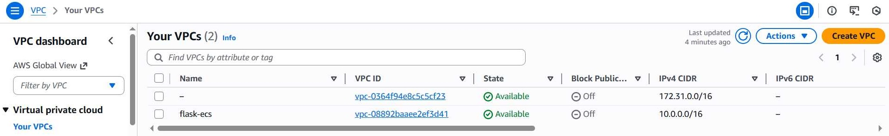  
*Figure: Dedicated VPC used for ECS deployment*

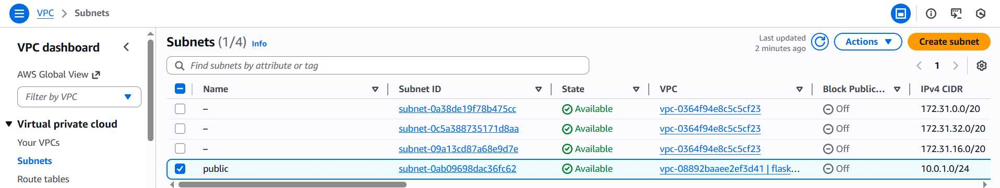  
*Figure: Public subnet associated to the route table*

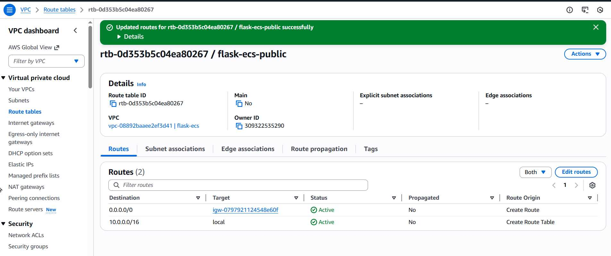  
*Figure: Route table providing 0.0.0.0/0 access through IGW*

---

## Local Development

Install dependencies  
```

pip install -r app/requirements.txt

```

Run locally  
```

python app/server.py

```

Build container  
```

docker build -t flask_app:latest .

```

Run container  
```

docker run -p 8080:8080 flask_app:latest

```

---

## GitHub Actions CI → ECR

CI builds the image and pushes it to ECR using OIDC authentication.  
Lifecycle policy ensures storage stays minimal.

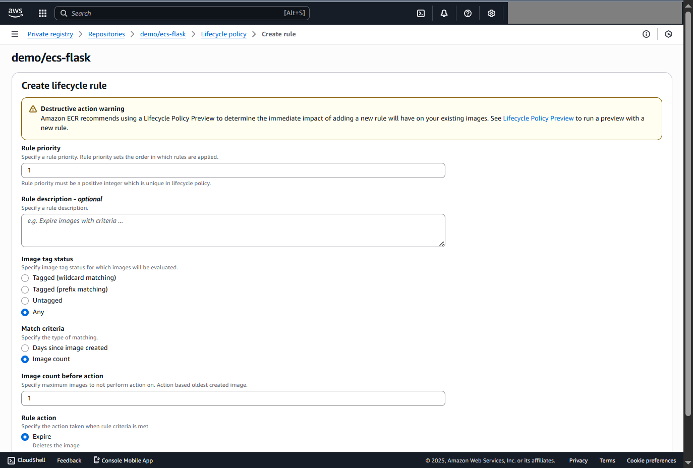  
*Figure: ECR policy retaining only the latest image*

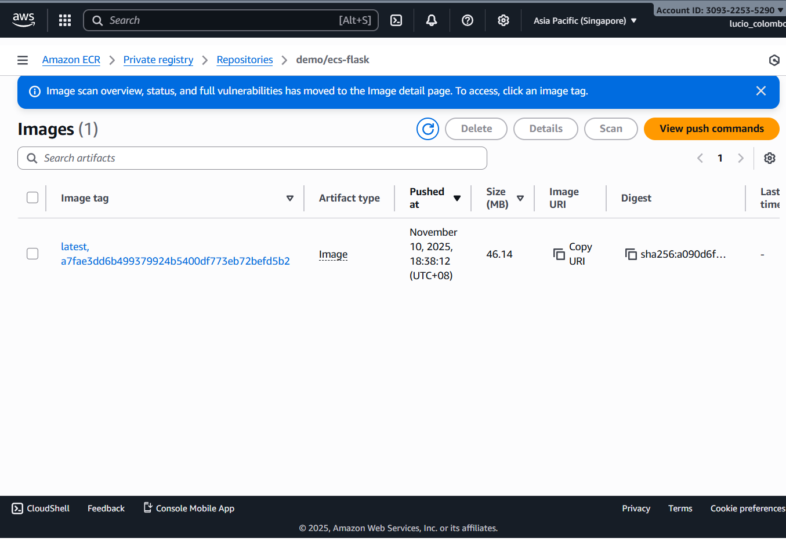  
*Figure: Docker image successfully pushed to ECR*

---

## ECS Fargate Deployment.

Public Fargate service with assigned public IP.  
Ingress allowed only from my IP.  
CloudWatch collects all container logs.

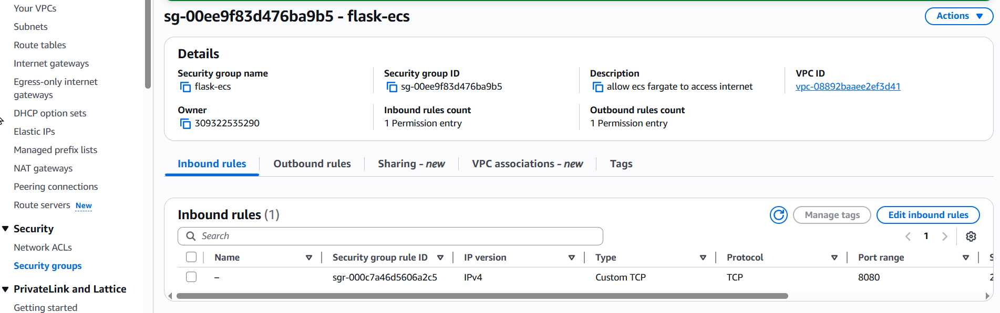  
*Figure: Inbound 8080 restricted to my IP*

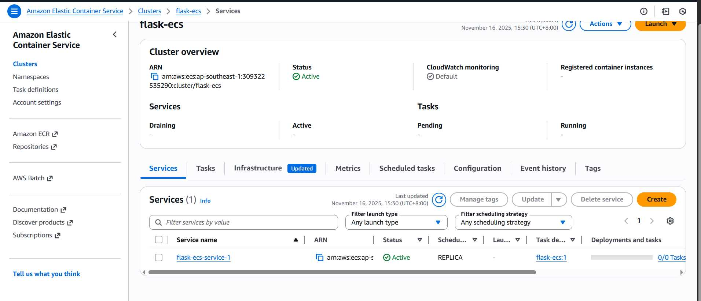  
*Figure: Desired count at zero to avoid Fargate billing*

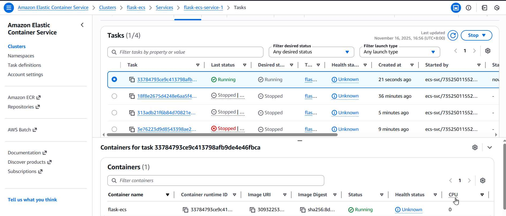  
*Figure: Task running successfully in the public subnet*

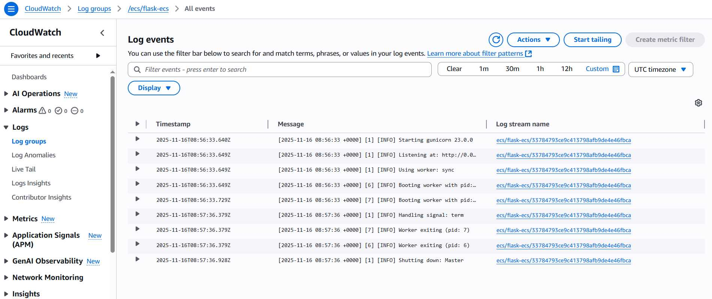  
*Figure: Gunicorn logs streamed to CloudWatch*

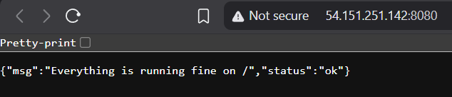  
*Figure: Flask app responding through the Fargate public IP*

---

## CloudFormation (Cluster View)

AWS displays the ECS cluster and its lifecycle events through a generated CloudFormation view.  
This confirms the ECS cluster is active and operating correctly.

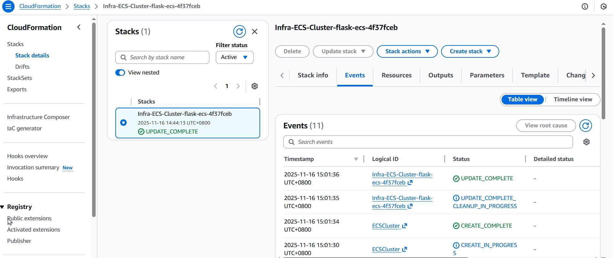  
*Figure: CloudFormation view showing the ECS cluster running successfully*

---

## Current Status

✔ CI to ECR operational  
✔ Fargate service running with public IP  
✔ VPC and routing validated  
✔ CloudWatch log ingestion active  
✔ Security hardened with IP-restricted SG  

---

## IaC (Terraform) – WIP

Terraform modules will manage:  
• VPC  
• Subnets and routing  
• Security groups  
• ECR  
• ECS cluster, task definition, and service  

---

## Next Steps

1 Add Terraform modules  
2 Add env vars and secrets  
3 Add ALB once autoscaling is required  
4 Implement rolling or blue/green deployments  
5 Add alarms and dashboards  

