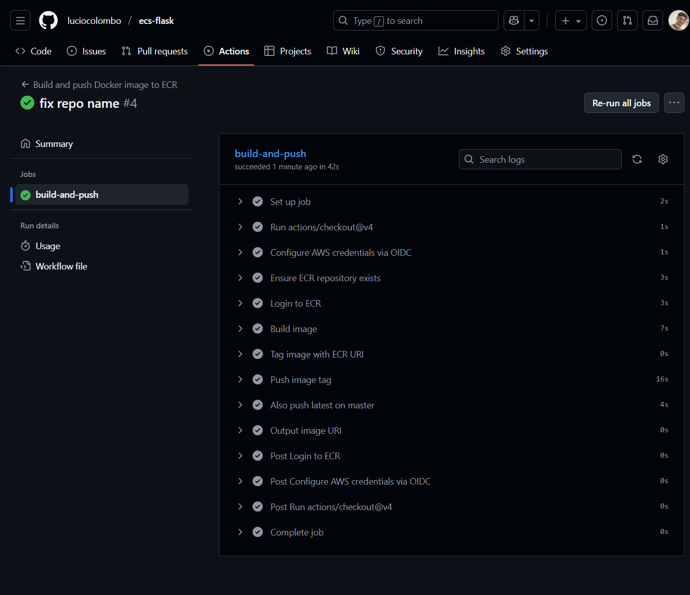

# Flask Codebase CI/CD and ECR Integration

This project sets up a delivery pipeline for a Flask codebase.
It currently uses a placeholder application while the container and registry workflow is being built.
The focus is on moving from source control to Amazon ECR, with ECS Fargate and related pieces added later WIP.

## Objectives

1. Build and containerize a Flask codebase
2. Automate image builds and ECR pushes with GitHub Actions
3. Use ECR lifecycle policies to control storage cost
4. Add ECS Fargate, load balancing, logging and operations later  WIP

## Pipeline overview

Current scope

1. Flask code served with Gunicorn
2. Docker image built locally and in CI
3. GitHub Actions workflow that validates the codebase and pushes images to ECR
4. ECR repository storing the latest container version with lifecycle cleanup

Planned work

1. ECS Fargate service and task definition  WIP
2. Networking, security groups and load balancer  WIP
3. CloudWatch logs, metrics and alarms  WIP

## Local development

Install dependencies

```bash
pip install -r app/requirements.txt
```

Run the application locally

```bash
python app/server.py
```

Build the container

```bash
docker build -t flask_app:latest .
```

Run the container

```bash
docker run -p 8080:5000 flask_app:latest
```

## GitHub Actions CI and ECR push

The repository uses GitHub Actions to automate testing, building and publishing images.

Workflow logic

1. On every push or pull request
   run checks, linting or tests
2. On push to the main branch
   authenticate to AWS through OIDC
   build the Docker image
   tag it with the commit SHA and with latest
   push it to the configured ECR repository

Required secrets or variables in the GitHub repository

1. AWS account id
2. AWS region
3. ECR repository name
4. IAM role to assume through OIDC

Placeholder for screenshot that shows all green GitHub checks

```markdown

```

## ECR integration

Images pushed from GitHub Actions appear in the ECR repository with the usual URI format

```text
<aws_account_id>.dkr.ecr.<region>.amazonaws.com/<repo>:<tag>
```

Placeholder for screenshot of the ECR console with the uploaded image

```markdown

```

## ECR lifecycle policy for cost control

ECR lifecycle policies can delete older images automatically.
For this project the repository is configured to retain only the most recent image in order to minimize storage usage.

Placeholder for screenshot of the lifecycle policy

```markdown

```

## ECS Fargate deployment  WIP

Planned content

1. Task definition based on the pushed image
2. Fargate service configuration
3. Networking, security groups and load balancer
4. Environment variables and secrets handling
5. Automatic rollouts

## Monitoring and observability  WIP

Planned content

1. CloudWatch log groups
2. Metrics, dashboards and alarms

## Future enhancements  WIP

1. Infrastructure as code for IAM, ECR and ECS
2. Multi environment pipeline configuration
3. Deployment strategies such as blue green or rolling updates
