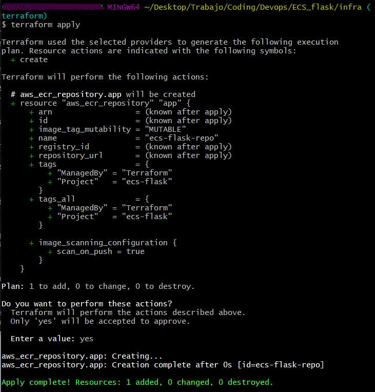
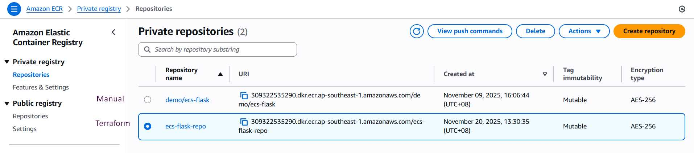

# Flask on ECS Fargate  
CI, ECR Integration, Networking, and Cost-Optimized Deployment

This repository demonstrates **two independent deployment paths**:

---

# Overview of Both Deployment Paths

### Path A — Manual Deployment (Historic Setup)
Your original, fully manual workflow:
- Docker image built locally or by GitHub Actions
- Pushed to ECR manually or via CI
- ECS Cluster and Service created manually in the AWS console
- VPC, Subnets, SG, and routing configured manually
- Logs verified in CloudWatch
- Running Fargate task validated manually

This path is **complete** and documented with screenshots.

### Path B — Terraform IaC Deployment (New, Professional Setup)
A clean, fully reproducible infrastructure built from scratch using Terraform:
- VPC
- Subnets
- IGW and route table
- Security group
- ECR repository
- ECS cluster

Terraform creates the base infrastructure.  
Task Definition + ECS Service will be added in the next phase once the image is in the Terraform-managed ECR.

Both paths coexist because they serve distinct purposes:
- Manual path = your original implementation  
- IaC path = your professional, reproducible version  
- They live in **different branches**

---

# Path A — Manual Deployment (Completed)

## Cost-Optimization Decisions

• Desired tasks initially set to zero  
• No ALB  
• ECR lifecycle keeps the latest image only  
• Public subnet + IGW (no NAT Gateway)  
• Security Group restricted to my IP  

---

## VPC, Subnet, Routing

  
  


---

## Local Development

```

pip install -r app/requirements.txt
python app/server.py
docker build -t flask_app:latest .
docker run -p 8080:8080 flask_app:latest

```

---

## GitHub Actions → ECR

  


---

## ECS Fargate Deployment (Manual)

  
  
  
  


---

## CloudFormation View


---

# Path B — Terraform IaC Deployment (New)

The new `infra/` directory contains Terraform configuration that builds a **clean, reproducible AWS environment**.

Current IaC resources created:

- VPC  
- Two public subnets  
- Internet Gateway  
- Route table + associations  
- Security Group  
- ECR repository  
- ECS Cluster  
- Terraform outputs for ECR URL and cluster name  

These correspond exactly to the resources shown in `terraform plan` and `terraform apply`.

---

## Terraform Screenshots

**terraform plan**


**terraform apply**



**ECR created via Terraform**



---

## Terraform Plan Output

Full raw output stored in:

🔗 **[plan_output.txt](/infra/plan_output.txt)**  

Contains all resources Terraform created:
- VPC  
- Subnets  
- IGW  
- Route tables  
- SG  
- ECS cluster  
- ECR repository  
- Outputs  

---

# Status Summary

### Path A (Manual)
✔ Fully working  
✔ Used for debugging and initial deployment  
✔ Ideal for validating each AWS component manually  

### Path B (Terraform)
✔ Base infrastructure created  
✔ Reproducible and clean setup  
✔ ECR + ECS cluster fully automated  
⬜ Task Definition (next step)  
⬜ ECS Service (next step)  
⬜ ALB (optional)  


